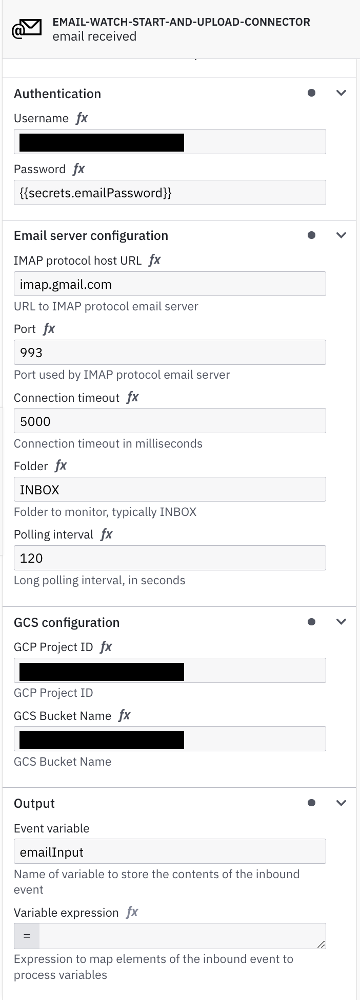

[](https://github.com/camunda-community-hub/community)
[](https://github.com/Camunda-Community-Hub/community/blob/main/extension-lifecycle.md#proof-of-concept-)


# Inbound Email Watch and GCS Upload Connector Template

!!! Work in progress, not intended for production !!!

A starting point to build a StartInbound Email Watch Connector. Monitor inbox folders for incoming emails and start process instances. Feedback and PRs are welcome! In the Connector you'll need to provide the username and password of the email account. For gmail you'll need to create an [app password](https://support.google.com/accounts/answer/185833?hl=en#). You'll need to provide the IMAP protocol host URL, port, and connection timeout. You'll also need to provide the folder to monitor (typically "INBOX") and the long polling interval in seconds. Upon connector startup it will check for unread emails and start instances or publish messages. It will then use IMAP's IDLE protocol to wait for new emails to avoid needless polling. Despite standards that say IDLE can be active for up to 30 minutes, most vendors will close connections after a few minutes so be sure to keep the long polling interval to under five minutes in most cases.

There are four outputs and can be accessed from the ```event``` object:
```event.from```,
```event.replyTo```,
```event.subject```,
```event.body```,
```events.gcsUploads```




## Build

You can package the Connector by running the following command:

```bash
mvn clean package
```

This will create the following artifacts:

- A thin JAR without dependencies.
- An uber JAR containing all dependencies, potentially shaded to avoid classpath conflicts. This will not include the SDK artifacts since those are in scope `provided` and will be brought along by the respective Connector Runtime executing the Connector.

### Shading dependencies

You can use the `maven-shade-plugin` defined in the [Maven configuration](./pom.xml) to relocate common dependencies
that are used in other Connectors and the [Connector Runtime](https://github.com/camunda-community-hub/spring-zeebe/tree/master/connector-runtime#building-connector-runtime-bundles).
This helps to avoid classpath conflicts when the Connector is executed.

Use the `relocations` configuration in the Maven Shade plugin to define the dependencies that should be shaded.
The [Maven Shade documentation](https://maven.apache.org/plugins/maven-shade-plugin/examples/class-relocation.html)
provides more details on relocations.

## API

### Connector Properties

This Connector can be configured with the following properties:

| Name                                                     | Description                                | Example                |
|----------------------------------------------------------|--------------------------------------------|------------------------|
| Username                                                 | Username to authenticate with email server | `username@camunda.com` |
| Password                                                 | Password to authenticate with email server | `notapassword`         |
| IMAP protocol host URL                                   | URL to IMAP protocol email server          | `imap.gmail.com`       |
| Port                                                     | Port the email server is using             | `993`                  |
| Connection timeout                                       | Connection timeout in milliseconds         | `5000`                 |
| Folder                                                   | Email folder to monitor, typically 'INBOX' | `INBOX`                |
| Polling interval                                         | Long polling interval, in seconds          | `120`                  |
| GCP Project ID                                           | GCP Project ID                             | `my cool gcp project`  |
| GCS Bucket Name                                          | Globally unique GCS Bucket Name            | `my bucket name`       |

### Environment Variables
To use your email password as a secret, e.g, ```{{secrets.emailPassword}}````, 
you'll have to set an environment variable ```emailPassword```.
To connect to GCP you can follow the instructions here: https://github.com/Acheron-Camunda/gcs-connector/#prereqisites
Set the GOOGLE_APPLICATION_CREDENTIALS environment variable to the path of your JSON key file.

### Output

This Connector produces the following output:

```json
{
  "event": {
    "from": [ {
      "address": "someaddress@somedomain.com",
      "personal": "somebody",
      "group": false,
      "type":"rfc822"
    } ],
    "replyTo": [ {
      "address": "someaddress@somedomain.com",
      "personal":"somebody",
      "group":false,
      "type":"rfc822"
    } ],
    "subject":"Some subject",
    "body":["Body of email"],
    "gcsUploads": [
      {
        "bucket": "aBucketName",
        "name": "a random UUID file name",
        "generation": aGenerationNumber
      }
    ]
  }
}
```

## Test locally

Run unit tests

```bash
mvn clean verify
```

### Test with local runtime

Use the [Camunda Connector Runtime](https://github.com/camunda-community-hub/spring-zeebe/tree/master/connector-runtime#building-connector-runtime-bundles) to run your function as a local Java application.

In your IDE you can also simply navigate to the `LocalContainerRuntime` class in test scope and run it via your IDE.
If necessary, you can adjust `application.properties` in test scope.

## Element Template

The element templates can be found in the element-templates directory.
